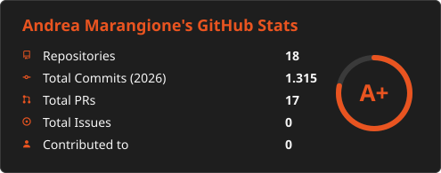
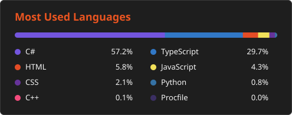

# 🌐 Hello World

> **Automate anything, find the right solution.**

I started at 19, and since then I've designed complete industrial plants — from the
production floor all the way to palletizing — then flown out to commission them on site
until every line ran fully autonomous, 24/7. China, Turkey, Spain, Germany, the USA.

These days I also build for the web. Same job, different runtime.

**The plants, the sites, the numbers → [andreamarangione.com](https://andreamarangione.com)**

---

## 🛠 Two stacks, one mindset

**Automation**

`Structured Text` `STL` `Ladder` `FBD` `TIA Portal` `Simatic Manager` `Startdrive`
`ToolboxST` `Proficy Machine Edition` `Cimplicity` `Profinet` `Profisafe` `Modbus` `EGD`

**Software**

`TypeScript` `JavaScript` `C#` `.NET` `Python` `C++` `React` `Next.js` `Node.js` `Express`
`PostgreSQL` `MongoDB` `Prisma` `Tailwind` `REST API` `Linux`

---

## 📈 Statistics

  
  

---

## 📫 Reach me

